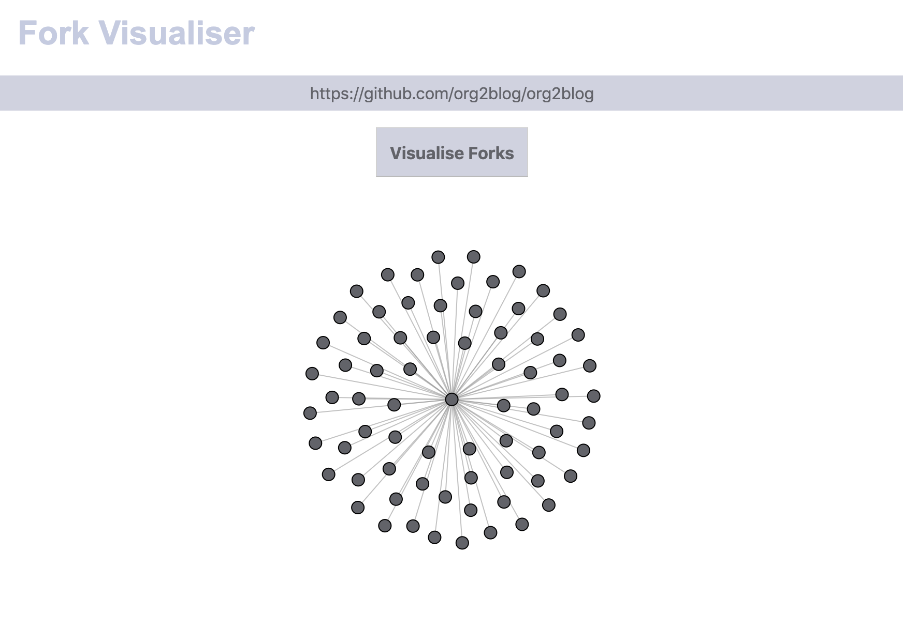

# fork-visualiser

A tool for visualising the forks of a github repository. Paste a link to a git repository to get a visualization of the number of forks made of the repo.

The tool is available online at [fork-visualiser.surge.sh/](http://fork-visualiser.surge.sh/)



## Project setup
```
npm install
```

### Compiles and hot-reloads for development
```
npm run serve
```

### Compiles and minifies for production
```
npm run build
```

### Lints and fixes files
```
npm run lint
```

### deploy with surge.sh
```
npm run deploy
```
